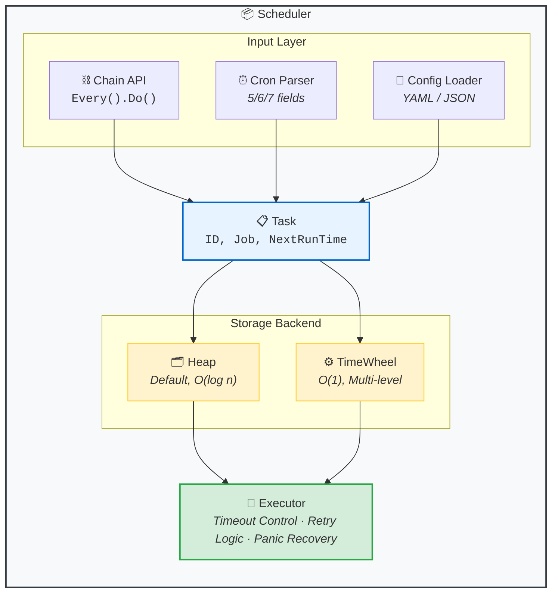

# GoLiteCron

[](https://go.dev/)
[](https://pkg.go.dev/github.com/hansir-hsj/GoLiteCron)
[](https://goreportcard.com/report/github.com/hansir-hsj/GoLiteCron)
[](LICENSE)
[](.)

A lightweight, high-performance cron job scheduler for Go with fluent API, dual storage backends, and built-in timeout/retry.

[中文文档](docs/readme.zh.md) | [Getting Started](docs/getting-started.md) | [API Reference](docs/api-reference.md)

## Why GoLiteCron?

| Feature | GoLiteCron | robfig/cron |
|---------|------------|-------------|
| **Fluent API** | `Every(10).Seconds().Do(fn)` | Not supported |
| **Storage Backends** | Heap + TimeWheel | Heap only |
| **Timeout & Retry** | Built-in | Manual implementation |
| **Config Files** | YAML / JSON | Not supported |
| **Cron Fields** | 5/6/7 fields (with years) | 5/6 fields |
| **Sequential Next() 100x** | **13.8ms** | 121ms (**8.8x slower**) |

### Performance Comparison (vs robfig/cron)

| Benchmark | GoLiteCron | robfig/cron | Winner |
|-----------|------------|-------------|--------|
| Next() - Minutely | **79 ns** | 196 ns | GoLiteCron **2.5x** |
| Next() - Sequential 100 calls | **13.8 ms** | 121 ms | GoLiteCron **8.8x** |
| Next() - Simple | 111 ns | 119 ns | GoLiteCron |
| Tick 1000 tasks (10 ready) | **5.5 µs** | - | Heap backend |

> Benchmarks run on Apple M4, Go 1.23. See [benchmark/](benchmark/) for details.

---

## Installation

```bash
go get -u github.com/hansir-hsj/GoLiteCron
```

## Quick Start

```go
scheduler := cron.NewScheduler()

// Fluent API
scheduler.Every(10).Seconds().Do(func() { fmt.Println("tick") })

// Cron expression
scheduler.AddTask("*/5 * * * *", cron.WrapJob("job-1", myFunc))

scheduler.Start()
defer scheduler.Stop()
select {}
```

---

## Architecture



---

## Cron Expression

```
┌───────────── minute (0-59)
│ ┌───────────── hour (0-23)
│ │ ┌───────────── day of month (1-31)
│ │ │ ┌───────────── month (1-12)
│ │ │ │ ┌───────────── day of week (0-6, Sunday=0)
* * * * *
```

**Special characters:** `*` (any) · `,` (list) · `-` (range) · `/` (step) · `L` (last) · `W` (weekday)

**Macros:** `@yearly` · `@monthly` · `@weekly` · `@daily` · `@hourly`

**Extended:** 6 fields with seconds (`WithSeconds()`), 7 fields with years (`WithYears()`)

> See [Getting Started](docs/getting-started.md#cron-expressions) for detailed examples.

---

## Chain API

```go
// Time intervals
scheduler.Every(30).Seconds().Do(job)
scheduler.Every(5).Minutes().Do(job)
scheduler.Every(2).Hours().Do(job)

// Specific time
scheduler.Every().Day().At("10:30").Do(job)
scheduler.Every().Monday().At("09:00").Do(job)

// With options
loc, _ := time.LoadLocation("Asia/Shanghai")
scheduler.Every().Day().At("09:00").
    WithTimeout(30*time.Second).
    WithRetry(3).
    WithLocation(loc).
    Do(job, "custom-task-id")
```

---

## Options

```go
cron.WithTimeout(30 * time.Second)  // Task timeout
cron.WithRetry(3)                   // Retry on failure
cron.WithLocation(loc)              // Timezone
cron.WithSeconds()                  // Enable 6-field cron
cron.WithYears()                    // Enable 7-field cron
```

---

## Storage Backends

```go
// Heap (default) - simple, good for fewer tasks
scheduler := cron.NewScheduler()

// TimeWheel - efficient for many tasks (O(1) tick)
scheduler := cron.NewScheduler(cron.StorageTypeTimeWheel)
```

---

## Load from Config

**config.yaml:**
```yaml
tasks:
  - id: "backup"
    cron_expr: "0 2 * * *"
    func_name: "backupJob"
    timeout: "1m"
    retry: 2
```

**main.go:**
```go
cron.RegisterJob("backupJob", func() error {
    return doBackup()
})

config, _ := cron.LoadFromYaml("config.yaml")
scheduler := cron.NewScheduler()
scheduler.LoadTasksFromConfig(config)
scheduler.Start()
```

---

## Task Management

```go
// List tasks
for _, task := range scheduler.GetTasks() {
    fmt.Printf("%s -> %s\n", task.ID, task.NextRunTime)
}

// Remove task
scheduler.RemoveTask(&cron.Task{ID: "task-id"})

// Graceful shutdown
scheduler.Stop()
```

---

## Documentation

- [Getting Started](docs/getting-started.md) - Detailed guide with examples
- [API Reference](docs/api-reference.md) - Types and functions
- [中文文档](docs/readme.zh.md) - Chinese documentation
- [Benchmarks](benchmark/README.md) - Performance details

## Examples

Run any example:

```bash
go run ./examples/basic
```

| Example | Description |
|---------|-------------|
| [basic](examples/basic) | Minimal setup, 5-minute quickstart |
| [fluent-api](examples/fluent-api) | Chain-style `Every().Day().At()` |
| [cron-expr](examples/cron-expr) | 5/6/7-field cron, L/W, macros |
| [config-file](examples/config-file) | YAML/JSON config loading |
| [error-handling](examples/error-handling) | Timeout, retry, context |
| [graceful](examples/graceful) | Signal handling, shutdown |

---

## Contributing

Contributions are welcome! Please feel free to submit a Pull Request.

1. Fork the repository
2. Create your feature branch (`git checkout -b feature/amazing-feature`)
3. Commit your changes (`git commit -m 'Add some amazing feature'`)
4. Push to the branch (`git push origin feature/amazing-feature`)
5. Open a Pull Request

---

## License

MIT License - see [LICENSE](LICENSE)
