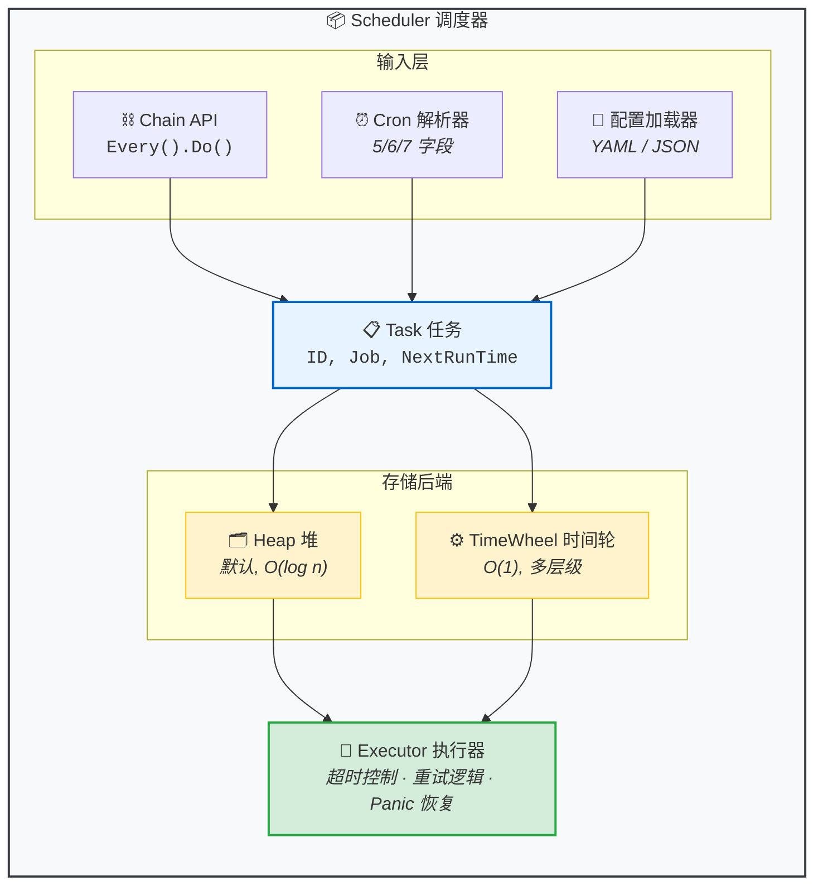

<p align="center">
  
</p>

# GoLiteCron

[](https://go.dev/)
[](https://pkg.go.dev/github.com/hansir-hsj/GoLiteCron)
[](https://goreportcard.com/report/github.com/hansir-hsj/GoLiteCron)
[](../LICENSE)
[](.)

轻量级、高性能的 Go 定时任务调度器，支持流式 API、双存储后端、内置超时重试。

[English](../README.md) | [入门指南](getting-started.zh.md) | [API 参考](api-reference.zh.md)

---

## 为什么选择 GoLiteCron？

| 特性 | GoLiteCron | robfig/cron |
|------|------------|-------------|
| **流式 API** | `Every(10).Seconds().Do(fn)` | 不支持 |
| **存储后端** | Heap + TimeWheel | 仅 Heap |
| **超时与重试** | 内置支持 | 需手动实现 |
| **配置文件** | YAML / JSON | 不支持 |
| **Cron 字段** | 5/6/7 字段（支持年份） | 5/6 字段 |
| **连续调度 Next() 100次** | **13.8ms** | 121ms (**慢 8.8 倍**) |

### 性能对比（vs robfig/cron）

| 测试项 | GoLiteCron | robfig/cron | 胜出 |
|--------|------------|-------------|------|
| Next() - 每分钟 | **79 ns** | 196 ns | GoLiteCron **2.5x** |
| Next() - 连续调用100次 | **13.8 ms** | 121 ms | GoLiteCron **8.8x** |
| Next() - 简单表达式 | 111 ns | 119 ns | GoLiteCron |
| Tick 1000任务 (10个就绪) | **5.5 µs** | - | Heap 后端 |

> 测试环境：Apple M4, Go 1.23。详见 [benchmark/](../benchmark/)

---

## 安装

```bash
go get -u github.com/hansir-hsj/GoLiteCron
```

## 快速开始

```go
scheduler := cron.NewScheduler()

// 流式 API
scheduler.Every(10).Seconds().Do(func() { fmt.Println("tick") })

// Cron 表达式
scheduler.AddTask("*/5 * * * *", cron.WrapJob("job-1", myFunc))

scheduler.Start()
defer scheduler.Stop()
select {}
```

---

## 架构



---

## Cron 表达式

```
┌───────────── 分钟 (0-59)
│ ┌───────────── 小时 (0-23)
│ │ ┌───────────── 日 (1-31)
│ │ │ ┌───────────── 月 (1-12)
│ │ │ │ ┌───────────── 星期 (0-6, 周日=0)
* * * * *
```

**特殊字符：** `*` (任意) · `,` (列表) · `-` (范围) · `/` (步长) · `L` (最后) · `W` (工作日)

**预定义宏：** `@yearly` · `@monthly` · `@weekly` · `@daily` · `@hourly`

**扩展格式：** 6字段含秒 (`WithSeconds()`)，7字段含年 (`WithYears()`)

> 详细示例请参阅 [入门指南](getting-started.zh.md#cron-表达式)

---

## 链式 API

```go
// 时间间隔
scheduler.Every(30).Seconds().Do(job)
scheduler.Every(5).Minutes().Do(job)
scheduler.Every(2).Hours().Do(job)

// 指定时间
scheduler.Every().Day().At("10:30").Do(job)
scheduler.Every().Monday().At("09:00").Do(job)

// 带选项
loc, _ := time.LoadLocation("Asia/Shanghai")
scheduler.Every().Day().At("09:00").
    WithTimeout(30*time.Second).
    WithRetry(3).
    WithLocation(loc).
    Do(job, "custom-task-id")
```

---

## 配置选项

```go
cron.WithTimeout(30 * time.Second)  // 任务超时
cron.WithRetry(3)                   // 失败重试
cron.WithLocation(loc)              // 时区
cron.WithSeconds()                  // 启用6字段cron
cron.WithYears()                    // 启用7字段cron
```

---

## 存储后端

```go
// Heap（默认）- 简单，适合少量任务
scheduler := cron.NewScheduler()

// TimeWheel - 高效，适合大量任务 (O(1) tick)
scheduler := cron.NewScheduler(cron.StorageTypeTimeWheel)
```

---

## 从配置文件加载

**config.yaml:**
```yaml
tasks:
  - id: "backup"
    cron_expr: "0 2 * * *"
    func_name: "backupJob"
    timeout: "1m"
    retry: 2
```

**main.go:**
```go
cron.RegisterJob("backupJob", func() error {
    return doBackup()
})

config, _ := cron.LoadFromYaml("config.yaml")
scheduler := cron.NewScheduler()
scheduler.LoadTasksFromConfig(config)
scheduler.Start()
```

---

## 任务管理

```go
// 列出任务
for _, task := range scheduler.GetTasks() {
    fmt.Printf("%s -> %s\n", task.ID, task.NextRunTime)
}

// 移除任务
scheduler.RemoveTask(&cron.Task{ID: "task-id"})

// 优雅关闭
scheduler.Stop()
```

---

## 详细文档

- [入门指南](getting-started.zh.md) - 详细使用示例
- [API 参考](api-reference.zh.md) - 类型与函数说明
- [English](../README.md) - 英文文档
- [性能测试](../benchmark/README.md) - 基准测试详情

## 示例代码

运行任意示例：

```bash
go run ./examples/basic
```

| 示例 | 说明 |
|------|------|
| [basic](../examples/basic) | 最简示例，5分钟快速上手 |
| [fluent-api](../examples/fluent-api) | 链式 API `Every().Day().At()` |
| [cron-expr](../examples/cron-expr) | 5/6/7字段 cron、L/W、宏 |
| [config-file](../examples/config-file) | YAML/JSON 配置文件加载 |
| [error-handling](../examples/error-handling) | 超时、重试、context 处理 |
| [graceful](../examples/graceful) | 信号处理、优雅关闭 |

---

## 参与贡献

欢迎贡献代码！请随时提交 Pull Request。

1. Fork 本仓库
2. 创建特性分支 (`git checkout -b feature/amazing-feature`)
3. 提交更改 (`git commit -m 'Add some amazing feature'`)
4. 推送到分支 (`git push origin feature/amazing-feature`)
5. 发起 Pull Request

---

## 许可证

MIT License - 详见 [LICENSE](../LICENSE)
